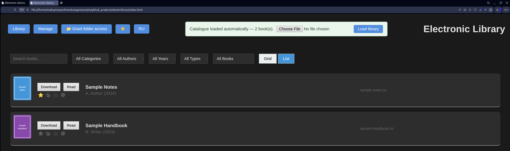

# Electronic Library

A small, dependency-free web app for cataloguing your ebooks. It runs from a
plain folder — open `index.html` in a browser, no server, no build step, no
install. Your catalogue **loads automatically** on every start, and the whole
library moves between computers with a copy of the folder.




## Features

- Book cards with covers, in **grid** or **list** view
- Search plus filters by category, author, year and file type
- Categories you can add and remove
- Classification lists (favorites, read later, work, hobby)
- Light / dark theme, and an **English / Russian** interface
- **Read** and **Download** straight from a card — reading opens a built-in
  viewer (pdf, txt, images natively; **djvu** through the bundled
  [DjVu.js](https://djvu.js.org))
- The catalogue is one file that loads by itself at startup
- Unsaved changes survive an accidental reload

## Getting started

```bash
git clone <this-repo> ebook-library
cd ebook-library
xdg-open index.html          # or just double-click index.html
```

1. Open `index.html` — the catalogue shipped in `data.js` (next to `index.html`)
   appears immediately, no clicks needed.
2. Copy your ebook files into `books/` (and covers into `thumbnails/`), then add
   the book under **Manage**.
3. Press **Save library** — a save dialog opens for `data.js`; put it next to
   `index.html`, replacing the old one. Chrome/Edge remember the folder, so from
   the second save on the dialog opens right there. Firefox/Safari download the
   file instead — move it out of Downloads yourself.

## How the catalogue is stored

A page opened as `file://` may **not** `fetch()` a local file — the browser
blocks it. That is why the catalogue is kept as JavaScript rather than plain
JSON:

```js
// data.js (next to index.html)
window.LIBRARY_DATA = { "books": [ ... ], "categories": [ ... ] };
```

`index.html` pulls that in with a `<script>` tag, which is allowed, so the
library is on screen with no clicks at all.

Writing is the other half. No browser API may touch the disk unprompted, so
saving is always an explicit dialog:

| | Chrome / Edge | Firefox / Safari |
|---|---|---|
| Adding a book | copy it into `books/` first | copy it into `books/` first |
| Saving the catalogue | save dialog; remembers the folder | plain download, move it yourself |

The catalogue format is identical either way, so a library filled in Chrome opens
in Firefox and back. **Load library** still reads a plain `.json`
catalogue as well as a `data.js`, so an older file can be opened by hand.

If a change is ever lost to an accidental reload, the app keeps a draft and
offers to restore it on the next start.

## Layout

```
ebook-library/
├── index.html          # open this
├── data.js             # your catalogue (auto-loaded; replaced when you save)
├── ebook_app/
│   ├── script.js       # application logic
│   ├── i18n.js         # interface translations (EN / RU)
│   ├── styles.css      # styling
│   ├── data.sample.json# the same demo catalogue as plain JSON
│   └── vendor/         # bundled DjVu.js (loaded lazily for .djvu books)
├── books/              # your ebook files
└── thumbnails/         # cover images
```

Book records store **relative paths** (`books/foo.pdf`, `thumbnails/foo.svg`),
never file contents — which is why those two folders have to stay next to
`index.html`.

## Notes

- Adding a book records only the *name* of the file you select, so copy the file
  into `books/` (and its cover into `thumbnails/`) yourself.
- **DjVu in the browser**: .djvu books open in the bundled
  [DjVu.js](https://djvu.js.org) viewer (`ebook_app/vendor/`, ~1 MB, loaded only
  when a djvu book is opened). DjVu.js needs Web Workers and XHR, which browsers
  block on `file://` pages — so this works when the library is served over
  http(s), e.g. `python3 -m http.server` in the library folder. On `file://` a
  djvu book falls back to a download offer.
- Deleting a book removes it from the catalogue only; the file stays on disk.
- The interface language follows your browser at first start and can be switched
  with the **RU / EN** button; adding a language means one more block in
  `ebook_app/i18n.js`.
- Interface preferences (theme, grid/list, language) live in `localStorage`. Book data does
  not: only a recovery draft of *unsaved* changes is kept there, and it is
  dropped as soon as you save.
- `data.js` is your own catalogue — it is committed here with demo
  content, so replace it (or keep it out of your commits) once you add real books.
